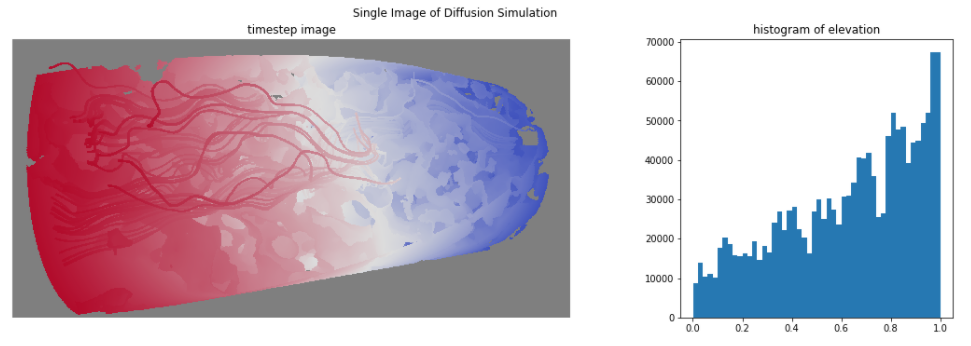
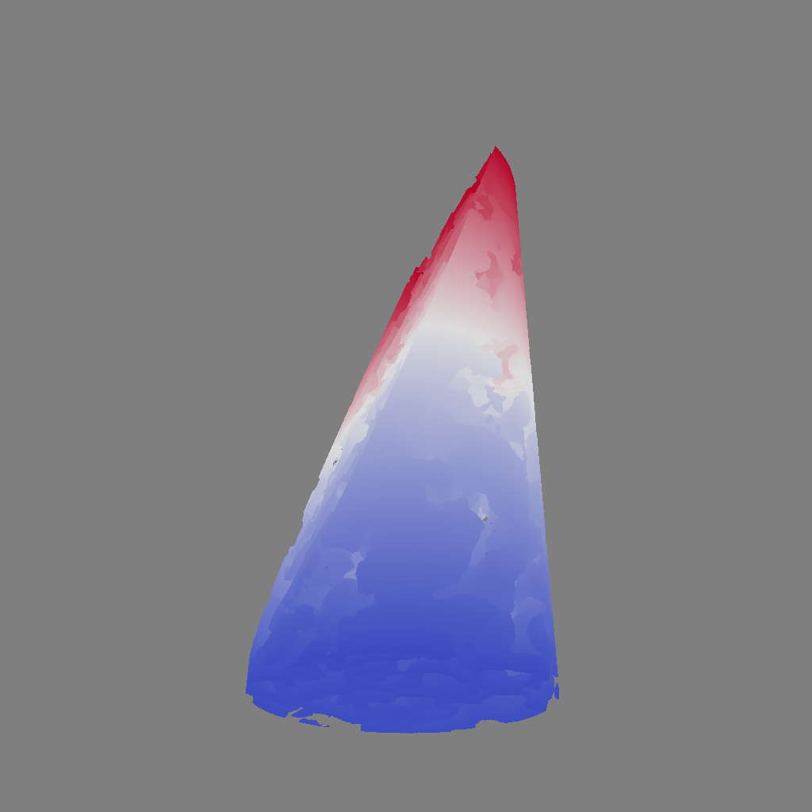
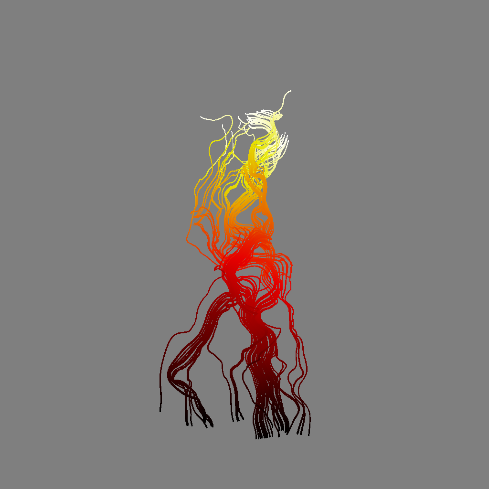
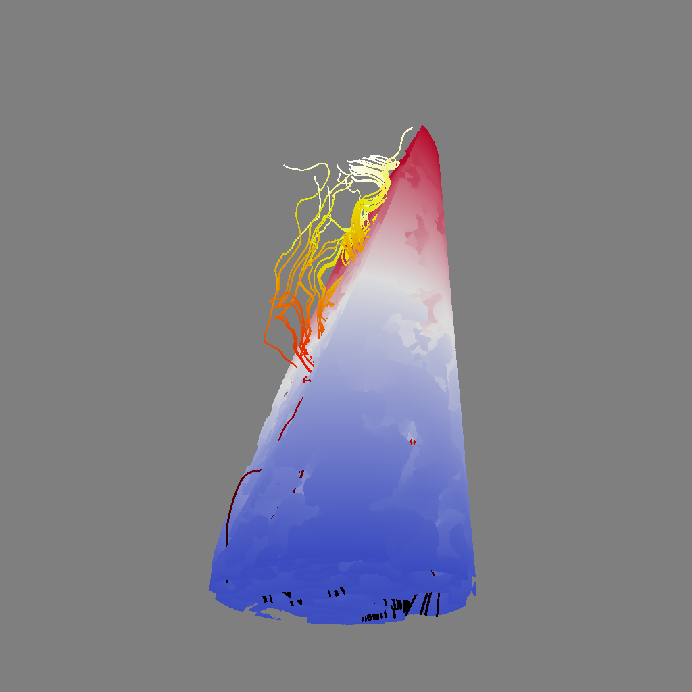
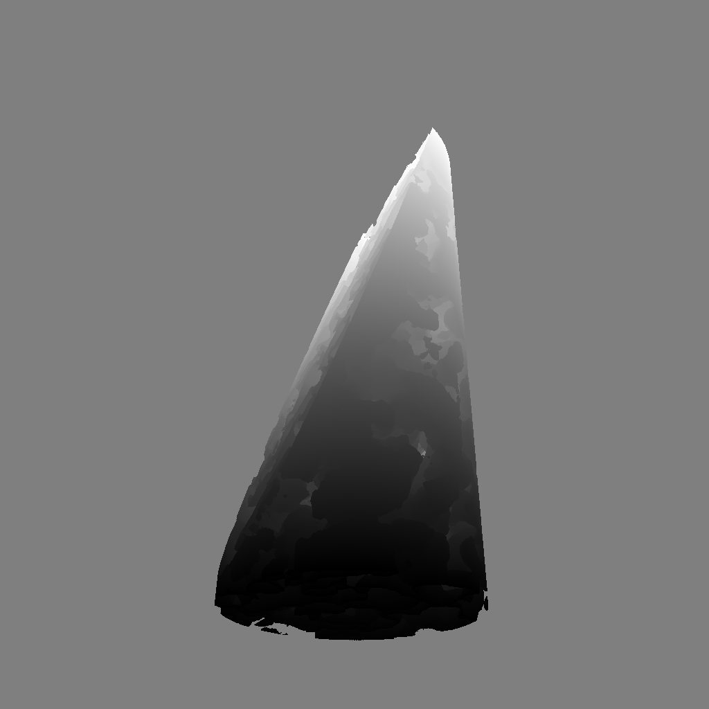
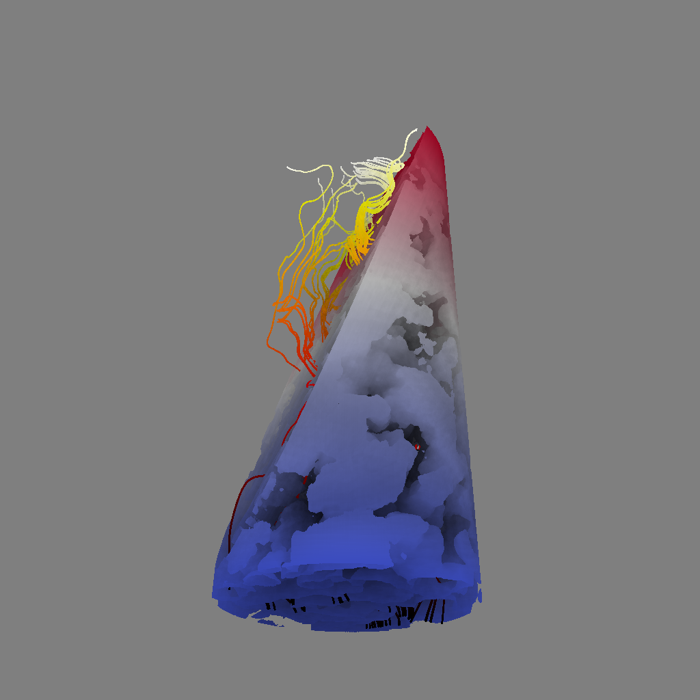

# CIS use cases

## Analysis and graphing of data

Because the CIS format contains data values, and not rendered pixels (RGB values, for example), the data can be used in a variety of ways. There are use cases which can specifically use the image to understand. In this simple example, implemented in a jupyter notebook, we can graph the values in a histogram, and then look at the image itself as well. These images and graphs are implemented through additions to the `cinemasci` module, which allow programmers and scientists to access the values in the images as python and numpy arrays.

<table style="width:250px">
<tr>
<td></img></td>
</tr>
<tr>
<td>Screen capture of a CIS viewer in a jupyter notebook. The image is rendered with a 'warm to cool' colormap (left), and the values are presented in a histogram (right).</td>
</tr>
</table>

## Interactive rendering

Using data within a CIS dataset, we can perform interactive rendering of images, providing a more flexible dataset for the viewer. The three things we can change are:

<table>
<tr>
<td>Interactive compositing. Using the depth values, a Cinema viewer can composite layers and interleave pixels from different objects, providing a more interactive visualization. In addition, .</td>
<td>
<table>
<tr>
<td></td>
<td></td>
<td></td>
</tr>
<tr>
<td>Stone Layer</td>
<td>Streamline Layer</td>
<td>Composited</td>
</tr>
</table>
</td>
</tr>

<tr>
<td>Interactive control of colormaps. The images are represented as float values of variables, so we can easily apply different colormaps to the data. This allows a great deal of freedom in adjusting the post-processing visualization.</td>
<td>
<table>
<tr>
<td></td>
<td></td>
</tr>
<tr>
<td>Warm to Cool colormap</td>
<td>Grey colormap</td>
</tr>
</table>
</td>
</tr>

<td>Interactive lighting. The images can be lit by an approximation of lighting if the data is included in the dataset.</td>
<td>
<table>
<tr>
<td></td>
<td></td>
</tr>
<tr>
<td>No shadow map</td>
<td>With shadow map</td>
</tr>
</table>
</td>
</table>

