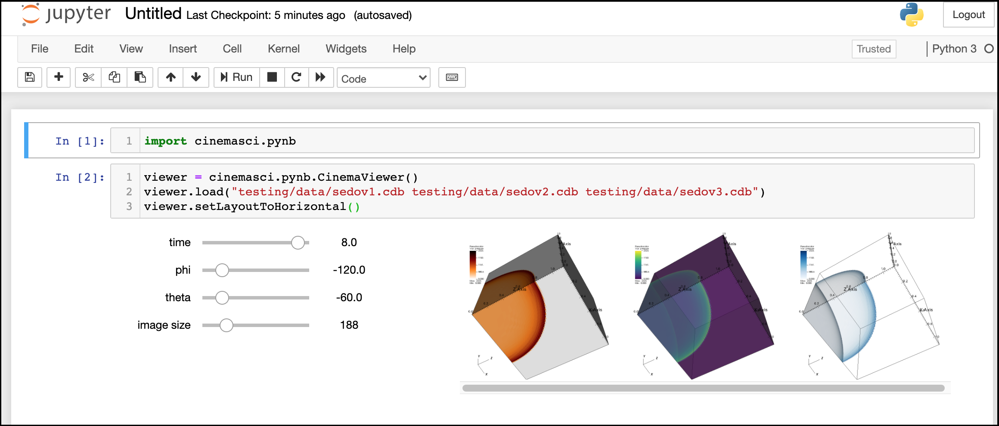

# Cinema Jupyter Notebook module

This is a basic Jupyter Notebook Viewer for the Cinema framework to view one or more Cinema databases. These modules allow users to load and view fully populated Cinema image databases of most common format images within the Jupyter Notebook interface. 

<p align="center">
</img>
</p>

## Requirements

1. The `jupyterlab` and `ipywidgets` Python libraries (and their dependencies) 
2. To use, run `jupyter notebook` from command line or integrate into existing ipynb file.

```
$ jupyter notebook
```

## Implementation

### Examples

#### Loading a Cinema Database

Load one or more databases

```
import cinemasci.pynb

# create a viewer object
viewer = cinemasci.pynb.CinemaViewer()

# load one cinema database
viewer.load("data/sedov1.cdb")

# load multiple cinema databases
viewer.load("data/sedov1.cdb data/sedov2.cdb")
viewer.load("data/sedov1.cdb data/sedov2.cdb data/sedov3.cdb")
```

Optionally, set layout properties of the viewer.

```
# set a horizontal orientation (defualt is vertical)
viewer.setLayoutToHorizontal()

# set it (back) to a vertical orientation
viewer.setLayoutToVertical()
```

#### UI manipulation

Manipulate UI-based controls. UI-based variables are those that deal purely with setting of the user interface, such as 'image size' and not with parameter of the Cinema database.

```
# list UI controller names
viewer.getUINames()

# list all UI controller names with current value
viewer.getUIValues()

# list all possible values for a UI controller
viewer.getUIOptions('image size')

# return the current value for a UI controller
viewer.getUIValue('image size')

# set the value for any UI controller(s)
viewer.setUIValues({'image size': 200})

# hide the controller of UI parameter 
viewer.hideUIControl('image size')

# show the controller of UI Parameter 
viewer.showUIControl('image size')
```

Manipulate Parameter-based controls. Parameters correspond column names of numeric parameters of the Cinema database. 

```
# list data parameter names
viewer.getParameterNames()

# list data parameter names with current value
viewer.getParameterValues()

# list all possible values for a data parameter
viewer.getParameterOptions('phi')

# return the current value for a data parameter
viewer.getParameterValue('phi')

# set the value for any data parameter(s) controller
viewer.setParameterValues({'theta': 72, 'phi': -108})

# hide the controller of data parameter
viewer.hideParameterControl('time')

# show the controller of data parameter
viewer.showParameterControl('time')
```
