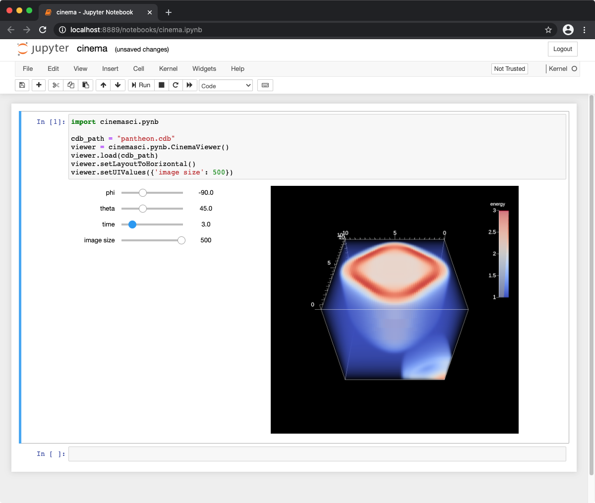
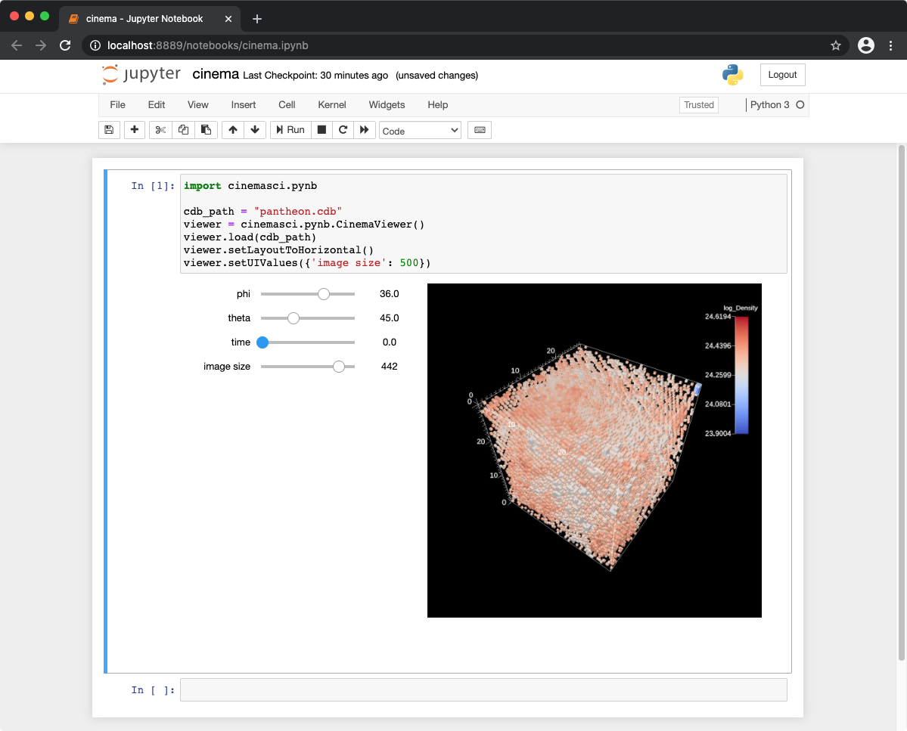
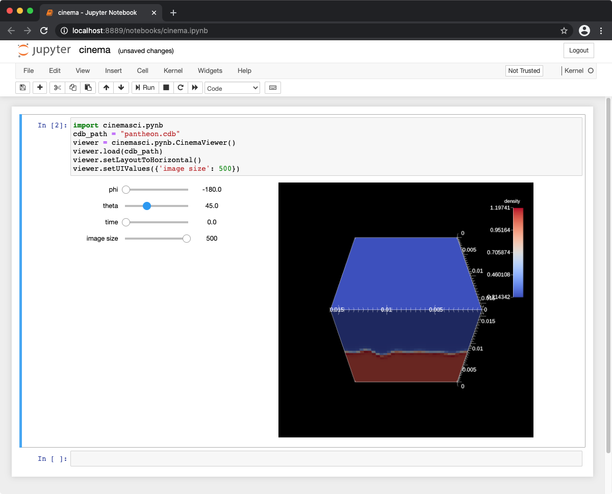

# Cinema Jupyter Notebook Examples

Cinema now includes Jupyter notebook components to view databases. These databases were created using science applications linked to <a href="https://ascent.readthedocs.io/en/latest">Ascent</a>, and viewed with an automatically generated ```ipynb``` file: 

<p align="center">
<table>
<tr>
<td style="text-align:center;">Cloverleaf3D</td>
<td style="text-align:center;">Nyx</td>
<td style="text-align:center;">PeleLM</td>
</tr>
<tr>
<td>
    <a href="https://gesis.mybinder.org/binder/v2/gh/cinemascience/cinema_binder/d0fb8584775cd671b2a596b349eb24c4c90f6af3">
        </img>
    </a>
</td>
<td></img></td>
<td></img></td>
</tr>
</table>
</p>

## Example notebook file

To view a Cinema database in jupyter notebook, first install the ```cinemasci``` module:

```
pip install cinemasci
```

This snippet is all the ```json``` you need in order to create a viewer on ```yourdata.cdb```. Save this file as ```cinema.ipynb```, then run jupyter notebook and load it.

```
{
    "cells": [
        {
        "cell_type": "code",
        "execution_count": 1,
        "metadata": {},
        "outputs": [],
        "source": [
            "import cinemasci.pynb\n",
            "\n",
            "cdb_path = \"yourdata.cdb\"\n",
            "viewer = cinemasci.pynb.CinemaViewer()\n",
            "viewer.load(cdb_path)\n",
            "viewer.setLayoutToHorizontal()\n",
            "viewer.setUIValues({'image size': 500})"
        ]
        }
    ],
    "metadata": {},
    "nbformat": 4,
    "nbformat_minor": 2
}
```

Alternatively, you can run jupyter notebook and enter the following python code:

```
    import cinemasci.pynb

    cdb_path = "yourdata.cdb"
    viewer = cinemasci.pynb.CinemaViewer()
    viewer.load(cdb_path)
    viewer.setLayoutToHorizontal()
    viewer.setUIValues({'image size': 500})
```


