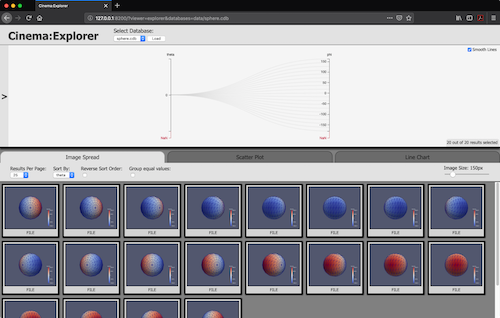
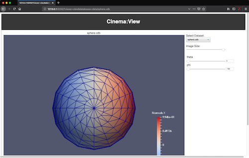
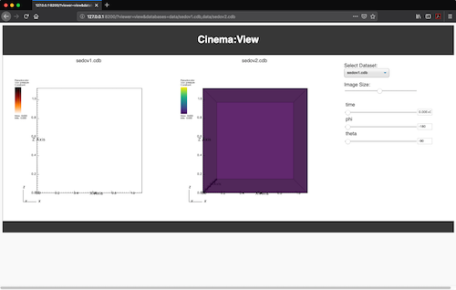

# Cinema simple web server design, v1.0

This is a basic server requested by Kitware, Inc. for inclusion in the next release of ParaView. The module will enable users to view Cinema databases with pvpython, using python's module execution option.

## Requirements

1. The Cinema Simple Web Server can serve a viewer type and one or more cinema databases using python's `-m <module>` capability.
1. The server can be started from the command line in any directory
1. The server can serve Cinema databases that are accessible (through file permissions) to the user, accessed by a relative path 
1. The server can serve databases that are accessible (through file permissions) to the user, accessed by an absolute path

## Implementation 

### Command Line Args

```
$ python -m cinemasci.cview --help
usage: __main__.py [-h] --data DATA --viewer VIEWER [--port PORT]
                   [--assetname ASSETNAME]

Run a Cinema Viewer

optional arguments:
  -h, --help            show this help message and exit
  --data DATA           database to view
  --viewer VIEWER       viewer type to use
  --port PORT           port to use
  --assetname ASSETNAME
                        asset name to use
```

### Examples

When the module is invoked with python, it will print out a URL, then start the server. The user can then paste the URL into a browser. The following examples have been tested in Firefox, Chrome and Safari:


```
    (cinema explorer, with a single relative database)
    python -m cinemasci.cview --viewer explorer --data data/sphere.cdb --port 8200
    http://127.0.0.1:8200/?viewer=explorer&databases=data/sphere.cdb
```
<p align="center">
</img>
</p>

```
    (cinema view, with a single relative database)
    python -m cinemasci.cview --viewer view --data data/sphere.cdb --port 8200
    http://127.0.0.1:8200/?viewer=view&databases=data/sphere.cdb
```
<p align="center">
</img>
</p>

```
    (cinema view, with two relative databases)
    python -m cinemasci.cview --viewer view --data data/sedov1.cdb,data/sedov2.cdb --port 8200
    http://127.0.0.1:8200/?viewer=view&databases=data/sedov1.cdb,data/sedov2.cdb
```
<p align="center">
</img>
</p>

